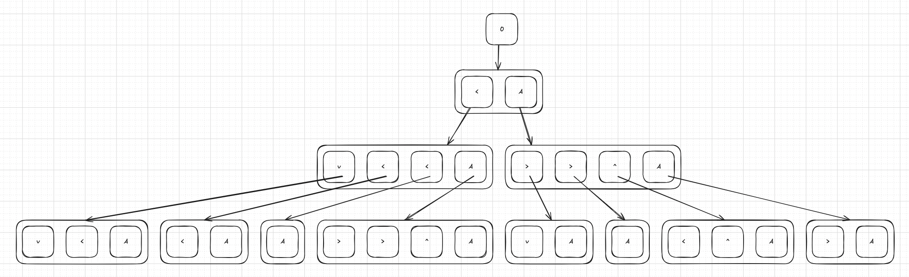

# Day 21: Keypad Conundrum

I'm left feeling a little ambiguous about my solution. On one hand it is a very generic approach which will correctly handle any keyboard layout you throw at it without having to change a line of code. On the other hand, I failed to extract the crucial bit of information regarding the best ordering of moves.

The other bit of awkwardness comes from using my `Grid` class. It certainly helps but I have to switch the content of the grid depending on which robot I am processing. While not a huge problem it does feel a bit off.

My initial approach was to process each robot in sequence. I would translate the code to the instructions for robot 1, then the instructions for robot 1 to robot 2, etc. This approach seemed to work okay until I got to the last code in the example and I got a wrong result. While debugging I learned for some key pairs there were multiple paths I could take and so I figured something was going on here which influenced my result.

While trying to figure out what was happening I kept running into problems visualizing how each robot was instructing the robot before. To help me understand the challenge better I drew a little chart for the first couple of robots trying to input the digit `0`.


It turned out the problem in my code was when having to input the sequence `37`. There are two ways to get from `3` to `7` for the second robot: `<<^^` and `^^<<`. While seemingly similar both sequences require very different instructions one or two robots down the line. This is part of the problem I never fully wrapped my head around. Maybe I will come back to this at a later point in time if it keeps bugging me.

My solution was to switch from processing robot to robot to processing one digit at a time for all the robots. I will take the digit and work out the instructions for the very last robot in the line for that one digit before going to the next digit. This allows me to process all the various paths and figure out which one is the shortest over all the robots. It also means I will be investigating paths I know will never be the best. For instance there is nothing excluding a path like `<^<^` which can never be better than `<<^^` or `^^<<`. Had my solution been slow I would've optimized more but at 6ms for part 1 and 13ms for part 2 the necessity is not there.

For part 2 I probably ran into the same problem as most people have, my strings were getting too large. This started happening way before reaching robot 26. Initially I was a bit stumped until it dawned on me that knowing the exact instructions for the last robot was not needed at all, it is only needed to know _how many_ instructions there are. Once I modified my code for this the answer for part 2 was found.

Rating: **Easy** / **Medium**

## Challenge description

### Part One

As you teleport onto Santa's *Reindeer-class starship*, The Historians begin to panic: someone from their search party is **missing**. A quick life-form scan by the ship's computer reveals that when the missing Historian teleported, he arrived in another part of the ship.

The door to that area is locked, but the computer can't open it; it can only be opened by **physically typing** the door codes (your puzzle input) on the numeric keypad on the door.

The numeric keypad has four rows of buttons: `789`, `456`, `123`, and finally an empty gap followed by `0A`. Visually, they are arranged like this:

```
+---+---+---+
| 7 | 8 | 9 |
+---+---+---+
| 4 | 5 | 6 |
+---+---+---+
| 1 | 2 | 3 |
+---+---+---+
    | 0 | A |
    +---+---+
```

Unfortunately, the area outside the door is currently **depressurized** and nobody can go near the door. A robot needs to be sent instead.

The robot has no problem navigating the ship and finding the numeric keypad, but it's not designed for button pushing: it can't be told to push a specific button directly. Instead, it has a robotic arm that can be controlled remotely via a **directional keypad**.

The directional keypad has two rows of buttons: a gap / `^` (up) / `A` (activate) on the first row and `<` (left) / `v` (down) / `>` (right) on the second row. Visually, they are arranged like this:

```
    +---+---+
    | ^ | A |
+---+---+---+
| < | v | > |
+---+---+---+
```

When the robot arrives at the numeric keypad, its robotic arm is pointed at the `A` button in the bottom right corner. After that, this directional keypad remote control must be used to maneuver the robotic arm: the up / down / left / right buttons cause it to move its arm one button in that direction, and the `A` button causes the robot to briefly move forward, pressing the button being aimed at by the robotic arm.

For example, to make the robot type `029A` on the numeric keypad, one sequence of inputs on the directional keypad you could use is:


- `<` to move the arm from `A` (its initial position) to `0`.
- `A` to push the `0` button.
- `^A` to move the arm to the `2` button and push it.
- `>^^A` to move the arm to the `9` button and push it.
- `vvvA` to move the arm to the `A` button and push it.

In total, there are three shortest possible sequences of button presses on this directional keypad that would cause the robot to type `029A`: `<A^A>^^AvvvA`, `<A^A^>^AvvvA`, and `<A^A^^>AvvvA`.

Unfortunately, the area containing this directional keypad remote control is currently experiencing **high levels of radiation** and nobody can go near it. A robot needs to be sent instead.

When the robot arrives at the directional keypad, its robot arm is pointed at the `A` button in the upper right corner. After that, a **second, different** directional keypad remote control is used to control this robot (in the same way as the first robot, except that this one is typing on a directional keypad instead of a numeric keypad).

There are multiple shortest possible sequences of directional keypad button presses that would cause this robot to tell the first robot to type `029A` on the door. One such sequence is `v<<A>>^A<A>AvA<^AA>A<vAAA>^A`.

Unfortunately, the area containing this second directional keypad remote control is currently **`-40` degrees**! Another robot will need to be sent to type on that directional keypad, too.

There are many shortest possible sequences of directional keypad button presses that would cause this robot to tell the second robot to tell the first robot to eventually type `029A` on the door. One such sequence is `<vA<AA>>^AvAA<^A>A<v<A>>^AvA^A<vA>^A<v<A>^A>AAvA^A<v<A>A>^AAAvA<^A>A`.

Unfortunately, the area containing this third directional keypad remote control is currently **full of Historians**, so no robots can find a clear path there. Instead, **you** will have to type this sequence yourself.

Were you to choose this sequence of button presses, here are all of the buttons that would be pressed on your directional keypad, the two robots' directional keypads, and the numeric keypad:

```
<vA<AA>>^AvAA<^A>A<v<A>>^AvA^A<vA>^A<v<A>^A>AAvA^A<v<A>A>^AAAvA<^A>A
v<<A>>^A<A>AvA<^AA>A<vAAA>^A
<A^A>^^AvvvA
029A
```

In summary, there are the following keypads:


- One directional keypad that **you** are using.
- Two directional keypads that **robots** are using.
- One numeric keypad (on a door) that a **robot** is using.

It is important to remember that these robots are not designed for button pushing. In particular, if a robot arm is ever aimed at a **gap** where no button is present on the keypad, even for an instant, the robot will **panic** unrecoverably. So, don't do that. All robots will initially aim at the keypad's `A` key, wherever it is.

To unlock the door, **five** codes will need to be typed on its numeric keypad. For example:

```
029A
980A
179A
456A
379A
```

For each of these, here is a shortest sequence of button presses you could type to cause the desired code to be typed on the numeric keypad:

```
029A: <vA<AA>>^AvAA<^A>A<v<A>>^AvA^A<vA>^A<v<A>^A>AAvA^A<v<A>A>^AAAvA<^A>A
980A: <v<A>>^AAAvA^A<vA<AA>>^AvAA<^A>A<v<A>A>^AAAvA<^A>A<vA>^A<A>A
179A: <v<A>>^A<vA<A>>^AAvAA<^A>A<v<A>>^AAvA^A<vA>^AA<A>A<v<A>A>^AAAvA<^A>A
456A: <v<A>>^AA<vA<A>>^AAvAA<^A>A<vA>^A<A>A<vA>^A<A>A<v<A>A>^AAvA<^A>A
379A: <v<A>>^AvA^A<vA<AA>>^AAvA<^A>AAvA^A<vA>^AA<A>A<v<A>A>^AAAvA<^A>A
```

The Historians are getting nervous; the ship computer doesn't remember whether the missing Historian is trapped in the area containing a **giant electromagnet** or **molten lava**. You'll need to make sure that for each of the five codes, you find the **shortest sequence** of button presses necessary.

The **complexity** of a single code (like `029A`) is equal to the result of multiplying these two values:


- The **length of the shortest sequence** of button presses you need to type on your directional keypad in order to cause the code to be typed on the numeric keypad; for `029A`, this would be `68`.
- The **numeric part of the code** (ignoring leading zeroes); for `029A`, this would be `29`.

In the above example, complexity of the five codes can be found by calculating `68 * 29`, `60 * 980`, `68 * 179`, `64 * 456`, and `64 * 379`. Adding these together produces **`126384`**.

Find the fewest number of button presses you'll need to perform in order to cause the robot in front of the door to type each code. **What is the sum of the complexities of the five codes on your list?**


### Part Two

Just as the missing Historian is released, The Historians realize that a **second** member of their search party has also been missing this entire time!

A quick life-form scan reveals the Historian is also trapped in a locked area of the ship. Due to a variety of hazards, robots are once again dispatched, forming another chain of remote control keypads managing robotic-arm-wielding robots.

This time, many more robots are involved. In summary, there are the following keypads:


- One directional keypad that **you** are using.
- **25** directional keypads that **robots** are using.
- One numeric keypad (on a door) that a **robot** is using.

The keypads form a chain, just like before: your directional keypad controls a robot which is typing on a directional keypad which controls a robot which is typing on a directional keypad... and so on, ending with the robot which is typing on the numeric keypad.

The door codes are the same this time around; only the number of robots and directional keypads has changed.

Find the fewest number of button presses you'll need to perform in order to cause the robot in front of the door to type each code. **What is the sum of the complexities of the five codes on your list?**
