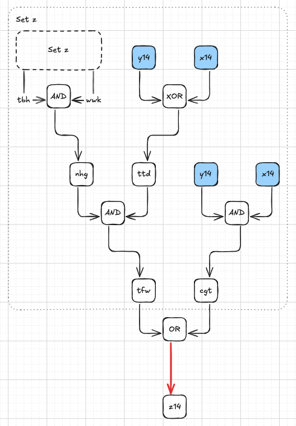

# Day 24: Crossed Wires

I think this might be my favorite challenge of this year. I had a lot of fun solving this. It started with part 1 which was I finished pretty quickly. At first I wasn't sure what would be the best way to resolve all the wire values and I started thinking about making a gate class and tracking dependencies and signaling when a wire got a value till eventually all wires are resolved. However I decided on something else because the challenge description said there are no loops and each wire is connected to at most one gate output and I figured from that that maybe it was more straightforward.

For part 1 I settled on a recursive method to retrieve the value for a wire. When the value is unknown I call the same method to get the values for both input wires so I can apply the logic gate and return the value of the wire. Because of the nature of the challenge this work well as you will always wind up at gates getting their input from a `yAA` and `xAA` wire, and these wires always have an initial value.

With part 2 I initially wasn't sure where to start. I knew result of device as it is in the challenge input and I could calculate the result it should give me by getting the `x` and `y` number and adding those up. I calculated the difference between the result and the expected result and thought of how I would have to manipulate the `z` wires for make up the difference. This got me nowhere. Having no clue how else to go about it, I resorted to the only thing I figured that was left to me, visualize the challenge input and look for patterns.

I started with sketching the challenge input and quickly had something like this:

Gates `z00` and `z01` were different but from `z02` onwards all the output wires had the same schematic feeding the output wire. I could manually add the values for the wires and could confirm that following this schema I was manually getting the same bits as my answer for part 1 was producing.

For too long I kept drawing the gates until it dawned on me that this was not needed at all. All I had to do was sketch out the schema for the lowest numbered `z` wire which had the wrong value. To this end I updated my part 2 solution to compare the bits of the result generated by the device with the bits from the correct answer and log with `z` wires are incorrect. This brought my attention to `z14`, this lowest numbered output wire with a wrong value.

When I drew the schema for `z14` it was immediately clear what the issue was.


The `z14` wire should be connected to the output of a `XOR` gate but here it is connected to an `OR` gate instead. Luckily the rest of schema looks familiar, it looked like it belonged to `z15`. After drawing `z15` I could confirm my hunch.

The `vss` node was getting its value from the `XOR` gate which should provide the value for `z14`! I had found the first two wires getting their value from the wrong gate.

Detecting and fixing this error in code was not too difficult. Detecting it meant checking the type of gate outputting the value to the `z` wire and making sure it is an `XOR` gate. If it is any other type of gate I can find the correct `XOR` gate in two steps:
1) Find the wire whose output comes from an XOR gate and whose input wires are `x` and `y` with the same index as the `z` were I detected has a problem. This is wire `tdd` in the schema above.
2) Find the wire whose output comes from an XOR gate and has the wire find in step 1 as one of its input wires. This is wire `vss`.

Once I have found wire 2 I can swap the output ports and that solves this particular problem in the device. So my input `z14` should get the value going to `vss` and `vss` should get the value which is going to `z14`.

In my input the device had three `z` wires with this kind of misconfiguration. Having fixed this bug in my device I could run my debug code again and see where the remaining problem was. The problem now started on wire `z22` so that's the wire whose schema I drew up next.

Here it was also quite easy to visually spot the error. The XOR node outputting to `z22` should be getting one of its inputs from another `XOR` node getting fed by the input wires with the same index as the output wire. For `z22` however the value came from an `AND` gate. An `AND` gate with `x22` and `y22` belongs in the schema for `z23` which was confirmed when I drew out the schema for `z23`.

Detecting this particular problem and fixing it is something by doing the following:
1) Check if the `XOR` gate feeding the `z` wire has an input which is not the output from an `OR` gate or a `XOR` gate. This is the wire connected to the wrong output. It is wire `kdh` for my input.
2) Find a wire getting its input from a `XOR` gate whose input wires have the same index as the `z` wire I detected has problem, this is wire `hjf`.

Once I corrected this mistake the output from the device was the sum of the `x` and `y` values and the challenge had been solved!

Rating: **Easy** / **Medium**

## Challenge description

### Part One

You and The Historians arrive at the edge of a *large grove* somewhere in the jungle. After the last incident, the Elves installed a small device that monitors the fruit. While The Historians search the grove, one of them asks if you can take a look at the monitoring device; apparently, it's been malfunctioning recently.

The device seems to be trying to produce a number through some boolean logic gates. Each gate has two inputs and one output. The gates all operate on values that are either **true** (`1`) or **false** (`0`).


- `AND` gates output `1` if **both** inputs are `1`; if either input is `0`, these gates output `0`.
- `OR` gates output `1` if **one or both** inputs is `1`; if both inputs are `0`, these gates output `0`.
- `XOR` gates output `1` if the inputs are **different**; if the inputs are the same, these gates output `0`.

Gates wait until both inputs are received before producing output; wires can carry `0`, `1` or no value at all. There are no loops; once a gate has determined its output, the output will not change until the whole system is reset. Each wire is connected to at most one gate output, but can be connected to many gate inputs.

Rather than risk getting shocked while tinkering with the live system, you write down all of the gate connections and initial wire values (your puzzle input) so you can consider them in relative safety. For example:

```
x00: 1
x01: 1
x02: 1
y00: 0
y01: 1
y02: 0

x00 AND y00 -> z00
x01 XOR y01 -> z01
x02 OR y02 -> z02
```

Because gates wait for input, some wires need to start with a value (as inputs to the entire system). The first section specifies these values. For example, `x00: 1` means that the wire named `x00` starts with the value `1` (as if a gate is already outputting that value onto that wire).

The second section lists all of the gates and the wires connected to them. For example, `x00 AND y00 -> z00` describes an instance of an `AND` gate which has wires `x00` and `y00` connected to its inputs and which will write its output to wire `z00`.

In this example, simulating these gates eventually causes `0` to appear on wire `z00`, `0` to appear on wire `z01`, and `1` to appear on wire `z02`.

Ultimately, the system is trying to produce a **number** by combining the bits on all wires starting with `z`. `z00` is the least significant bit, then `z01`, then `z02`, and so on.

In this example, the three output bits form the binary number `100` which is equal to the decimal number **`4`**.

Here's a larger example:

```
x00: 1
x01: 0
x02: 1
x03: 1
x04: 0
y00: 1
y01: 1
y02: 1
y03: 1
y04: 1

ntg XOR fgs -> mjb
y02 OR x01 -> tnw
kwq OR kpj -> z05
x00 OR x03 -> fst
tgd XOR rvg -> z01
vdt OR tnw -> bfw
bfw AND frj -> z10
ffh OR nrd -> bqk
y00 AND y03 -> djm
y03 OR y00 -> psh
bqk OR frj -> z08
tnw OR fst -> frj
gnj AND tgd -> z11
bfw XOR mjb -> z00
x03 OR x00 -> vdt
gnj AND wpb -> z02
x04 AND y00 -> kjc
djm OR pbm -> qhw
nrd AND vdt -> hwm
kjc AND fst -> rvg
y04 OR y02 -> fgs
y01 AND x02 -> pbm
ntg OR kjc -> kwq
psh XOR fgs -> tgd
qhw XOR tgd -> z09
pbm OR djm -> kpj
x03 XOR y03 -> ffh
x00 XOR y04 -> ntg
bfw OR bqk -> z06
nrd XOR fgs -> wpb
frj XOR qhw -> z04
bqk OR frj -> z07
y03 OR x01 -> nrd
hwm AND bqk -> z03
tgd XOR rvg -> z12
tnw OR pbm -> gnj
```

After waiting for values on all wires starting with `z`, the wires in this system have the following values:

```
bfw: 1
bqk: 1
djm: 1
ffh: 0
fgs: 1
frj: 1
fst: 1
gnj: 1
hwm: 1
kjc: 0
kpj: 1
kwq: 0
mjb: 1
nrd: 1
ntg: 0
pbm: 1
psh: 1
qhw: 1
rvg: 0
tgd: 0
tnw: 1
vdt: 1
wpb: 0
z00: 0
z01: 0
z02: 0
z03: 1
z04: 0
z05: 1
z06: 1
z07: 1
z08: 1
z09: 1
z10: 1
z11: 0
z12: 0
```

Combining the bits from all wires starting with `z` produces the binary number `0011111101000`. Converting this number to decimal produces **`2024`**.

Simulate the system of gates and wires. **What decimal number does it output on the wires starting with `z`?**


### Part Two

After inspecting the monitoring device more closely, you determine that the system you're simulating is trying to **add two binary numbers**.

Specifically, it is treating the bits on wires starting with `x` as one binary number, treating the bits on wires starting with `y` as a second binary number, and then attempting to add those two numbers together. The output of this operation is produced as a binary number on the wires starting with `z`. (In all three cases, wire `00` is the least significant bit, then `01`, then `02`, and so on.)

The initial values for the wires in your puzzle input represent **just one instance** of a pair of numbers that sum to the wrong value. Ultimately, **any** two binary numbers provided as input should be handled correctly. That is, for any combination of bits on wires starting with `x` and wires starting with `y`, the sum of the two numbers those bits represent should be produced as a binary number on the wires starting with `z`.

For example, if you have an addition system with four `x` wires, four `y` wires, and five `z` wires, you should be able to supply any four-bit number on the `x` wires, any four-bit number on the `y` numbers, and eventually find the sum of those two numbers as a five-bit number on the `z` wires. One of the many ways you could provide numbers to such a system would be to pass `11` on the `x` wires (`1011` in binary) and `13` on the `y` wires (`1101` in binary):

```
x00: 1
x01: 1
x02: 0
x03: 1
y00: 1
y01: 0
y02: 1
y03: 1
```

If the system were working correctly, then after all gates are finished processing, you should find `24` (`11+13`) on the `z` wires as the five-bit binary number `11000`:

```
z00: 0
z01: 0
z02: 0
z03: 1
z04: 1
```

Unfortunately, your actual system needs to add numbers with many more bits and therefore has many more wires.

Based on forensic analysis of scuff marks and scratches on the device, you can tell that there are exactly **four** pairs of gates whose output wires have been **swapped**. (A gate can only be in at most one such pair; no gate's output was swapped multiple times.)

For example, the system below is supposed to find the bitwise `AND` of the six-bit number on `x00` through `x05` and the six-bit number on `y00` through `y05` and then write the result as a six-bit number on `z00` through `z05`:

```
x00: 0
x01: 1
x02: 0
x03: 1
x04: 0
x05: 1
y00: 0
y01: 0
y02: 1
y03: 1
y04: 0
y05: 1

x00 AND y00 -> z05
x01 AND y01 -> z02
x02 AND y02 -> z01
x03 AND y03 -> z03
x04 AND y04 -> z04
x05 AND y05 -> z00
```

However, in this example, two pairs of gates have had their output wires swapped, causing the system to produce wrong answers. The first pair of gates with swapped outputs is `x00 AND y00 -> z05` and `x05 AND y05 -> z00`; the second pair of gates is `x01 AND y01 -> z02` and `x02 AND y02 -> z01`. Correcting these two swaps results in this system that works as intended for any set of initial values on wires that start with `x` or `y`:

```
x00 AND y00 -> z00
x01 AND y01 -> z01
x02 AND y02 -> z02
x03 AND y03 -> z03
x04 AND y04 -> z04
x05 AND y05 -> z05
```

In this example, two pairs of gates have outputs that are involved in a swap. By sorting their output wires' names and joining them with commas, the list of wires involved in swaps is **`z00,z01,z02,z05`**.

Of course, your actual system is much more complex than this, and the gates that need their outputs swapped could be **anywhere**, not just attached to a wire starting with `z`. If you were to determine that you need to swap output wires `aaa` with `eee`, `ooo` with `z99`, `bbb` with `ccc`, and `aoc` with `z24`, your answer would be **`aaa,aoc,bbb,ccc,eee,ooo,z24,z99`**.

Your system of gates and wires has **four** pairs of gates which need their output wires swapped - **eight** wires in total. Determine which four pairs of gates need their outputs swapped so that your system correctly performs addition; **what do you get if you sort the names of the eight wires involved in a swap and then join those names with commas?**
