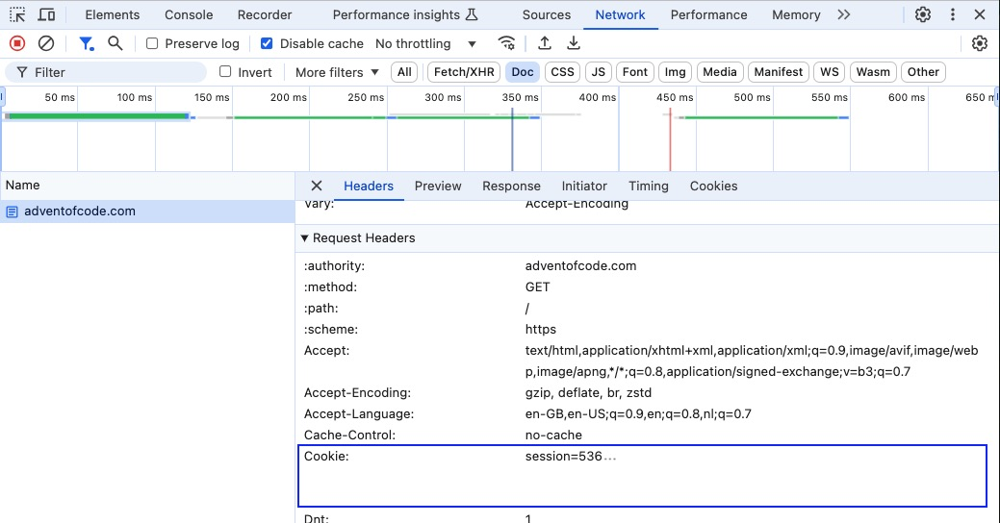

# ✨🎄 Advent of Code 🎄✨

These are my solutions for the puzzles of [Advent of Code](https://adventofcode.com/). I enjoy writing code in TypeScript, so that’s what I used. This repository contains everything you need to run my solutions.

## Setup

The solutions require NodeJS version 22.1.0 to run. In addition, you need a few packages; these can be installed by running the `pnpm install` command from the root folder of the project.

### Challenge folder structure

Challenges are grouped per year, in a folder named after the full year. Each year folder contains a directory for each day, named using two-digit numbers. For example, the solution for the challenge of December 9, 2015 can be found in [2015/09](./2015/09/).

### Advent of Code session ID

By default, running a solution will download the challenge input if there is no `input.txt` present in the solution folder. To download the challenge input, your session ID for the Advent of Code website is required.

To get your session ID cookie, visit the [Advent of Code](https://adventofcode.com/) website and log in. Using your browser’s inspector, find the value of the `session` cookie.



This value needs to be inserted into a `.env` file that you create in the [root folder](./) of the project. See the `.env.example` file for an example.

## Scaffolding a solution

There is a scaffold available that sets up the basics for a solution for a specific day. To scaffold a day, run the following command from the terminal:

```bash
pnpm scaffold <year>/<day>
```

For example, to scaffold the solution for day 1 of 2015, run:

```bash
pnpm scaffold 2015/1
```

## Running a solution

To run a solution, use the following command:

```bash
pnpm solve <year>/<day>/<part>
```

For instance, to run the solution for day 2, part 1:

```bash
pnpm solve 2015/2/1
```

### Puzzle input

Each solution requires the puzzle input. When there is no `input.txt` file in the day folder, the input will be downloaded from the Advent of Code website. Because the input differs per account, a session ID cookie is needed. See the [Advent of Code session ID](#advent-of-code-session-id) section for instructions on setting the session ID.

If you want to use custom input instead, you can create an `input.txt` file yourself and populate it with whatever data you want to use.

## Benchmarking a solution

If you want to see how fast a given solution runs, there is a measurement script that benchmarks it. It will run the solution multiple times and report the fastest and slowest runs, as well as the median and average execution times.

To run the benchmark, execute:

```bash
pnpm measure <year>/<day>/<part>
```

To benchmark the solution for part 2 of day 1 in 2015:

```bash
pnpm measure 2015/1/2
```

By default, the script will run the solution 50 times. You can specify a different sample size by adding a second parameter. The following command will take 75 samples:

```bash
pnpm measure 2015/1/2 75
```
